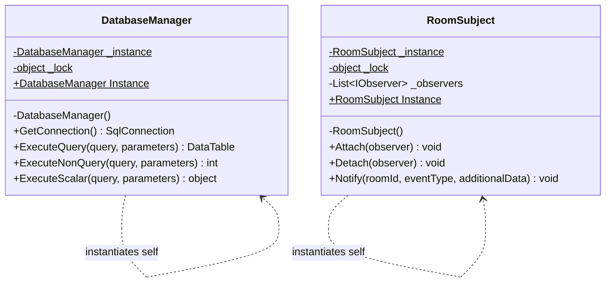
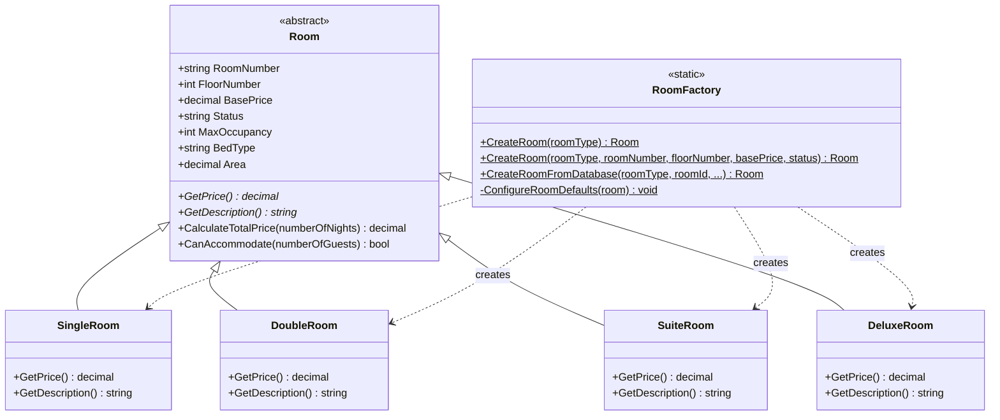
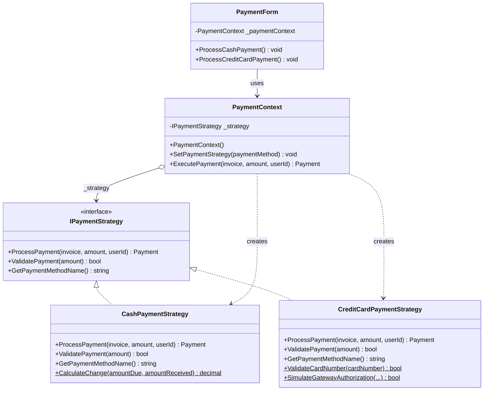
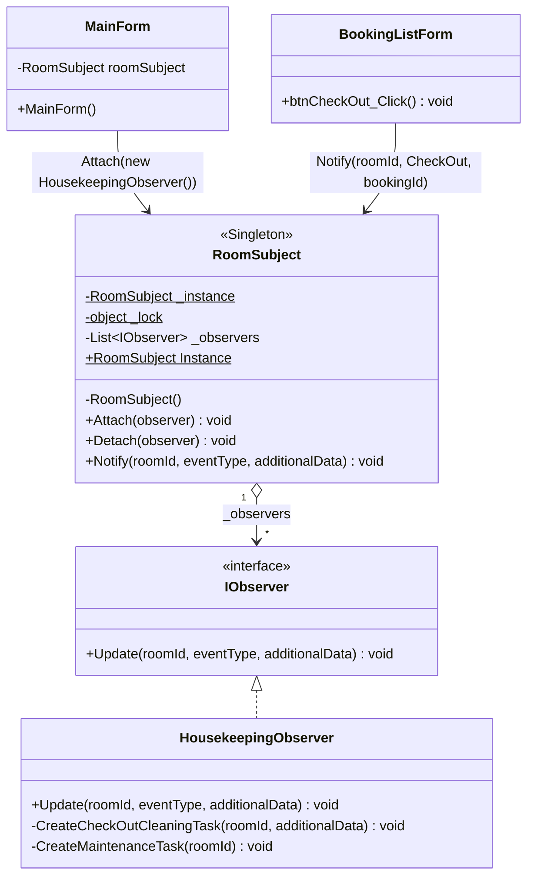
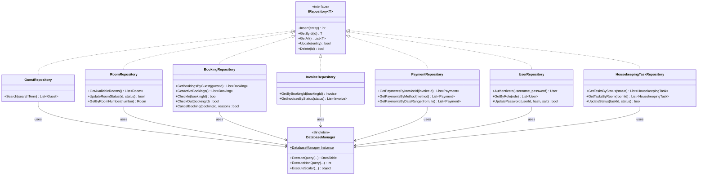
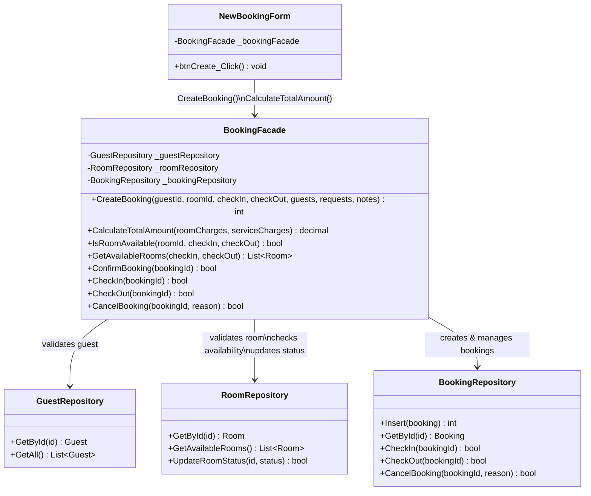

# UML Diagrams — Design Patterns

This document contains **class diagrams** for all 6 design patterns implemented in the Hotel Management System.  
Individual PlantUML (`.puml`) source files are located in the [`UML_Diagrams/`](./UML_Diagrams/) folder.

---

## Pattern 1 — Singleton

> Ensures a single shared instance of `DatabaseManager` (database access) and `RoomSubject` (event hub) throughout the application.

**Files:** `DAL/DatabaseManager.cs`, `Patterns/RoomSubject.cs`

---

## Pattern 2 — Factory Method

> Centralizes the creation of typed `Room` objects (Single, Double, Suite, Deluxe) with their default configurations and pricing logic.

**Files:** `BLL/Factories/RoomFactory.cs`, `Models/Room.cs` (+ 4 subclasses)

---

## Pattern 3 — Strategy

> Allows switching between `CashPaymentStrategy` and `CreditCardPaymentStrategy` at runtime without changing the payment workflow.

**Files:** `Patterns/IPaymentStrategy.cs`, `Patterns/CashPaymentStrategy.cs`, `Patterns/CreditCardPaymentStrategy.cs`, `Patterns/PaymentContext.cs`

---

## Pattern 4 — Observer

> Decouples checkout logic from housekeeping: when a guest checks out, `RoomSubject` notifies `HousekeepingObserver`, which auto-creates a cleaning task.

**Files:** `Patterns/IObserver.cs`, `Patterns/RoomSubject.cs`, `Patterns/HousekeepingObserver.cs`

---

## Pattern 5 — Repository

> Separates all SQL data access behind a generic `IRepository<T>` interface; each of the 7 entities has its own repository with both standard CRUD and extended query methods.

**Files:** `DAL/IRepository.cs`, `DAL/GuestRepository.cs`, `DAL/RoomRepository.cs`, `DAL/BookingRepository.cs`, `DAL/InvoiceRepository.cs`, `DAL/PaymentRepository.cs`, `DAL/UserRepository.cs`, `DAL/HousekeepingTaskRepository.cs`

---

## Pattern 6 — Facade

> Hides the complexity of coordinating 3 repositories and 8 validation/creation steps behind a single `BookingFacade.CreateBooking()` call.

**Files:** `BLL/BookingFacade.cs`

---

## Summary

| # | Pattern | Intent | Key Files |
|---|---------|--------|-----------|
| 1 | **Singleton** | One shared instance of DB manager & event subject | `DatabaseManager.cs`, `RoomSubject.cs` |
| 2 | **Factory Method** | Centralized, type-safe room object creation | `RoomFactory.cs`, `Room.cs` + subclasses |
| 3 | **Strategy** | Pluggable payment algorithms (Cash / Credit Card) | `IPaymentStrategy.cs`, `PaymentContext.cs` |
| 4 | **Observer** | Event-driven housekeeping on checkout | `IObserver.cs`, `HousekeepingObserver.cs` |
| 5 | **Repository** | Unified data access layer for all 7 entities | `IRepository.cs` + 7 repositories |
| 6 | **Facade** | Simplified booking workflow (8 steps → 1 call) | `BookingFacade.cs` |
